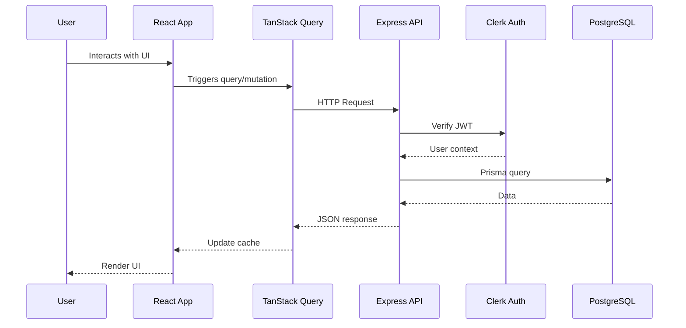

# Data Flow & Integrations

This document explains how data enters, moves through, and exits the Task Management System.

## High-level Flow

## Module Dependencies

### Server Dependencies
- **server/** → `prisma/client`, `@clerk/express`
- **server/storage.ts** → `@prisma/client` for database operations
- **server/auth.ts** → `@clerk/express` for authentication

### Client Dependencies
- **client/src/app/** → `features/*`, `shared/*`
- **client/src/features/tasks/** → `shared/hooks`, `shared/components`, `shared/lib`
- **client/src/features/clients/** → `shared/hooks`, `shared/components`, `features/tasks/lib`
- **client/src/features/meetings/** → `shared/hooks`, `shared/components`
- **client/src/features/auth/** → `shared/components`, `@clerk/clerk-react`

## Service Layer

### Backend Services
- [`DbStorage`](../server/storage.ts) - Primary data access class
  - User operations: `getUser`, `createUser`, `updateUser`
  - Task operations: `getTasks`, `createTask`, `updateTask`, `deleteTask`
  - Client operations: `getClients`, `createClient`, `updateClient`
  - Meeting operations: `getMeetings`, `createMeeting`

### Frontend Services
- [`apiRequest`](../client/src/shared/lib/queryClient.ts) - HTTP client wrapper
- [`useCurrentUser`](../client/src/features/users/hooks/useCurrentUser.ts) - User context hook

## Data Flow Patterns

### Query Flow (Read Operations)

1. **Component Mount**: React component renders
2. **Query Initialization**: TanStack Query hook triggers
3. **Cache Check**: Check if data exists in query cache
4. **API Request**: If stale/missing, fetch from API
5. **Authentication**: Clerk middleware validates JWT
6. **Database Query**: Prisma executes SQL
7. **Response**: Data flows back through layers
8. **Cache Update**: TanStack Query updates cache
9. **Re-render**: Component re-renders with data

### Mutation Flow (Write Operations)

1. **User Action**: Form submission or button click
2. **Optimistic Update**: (Optional) Update UI immediately
3. **API Request**: POST/PUT/PATCH/DELETE to API
4. **Validation**: Server validates input
5. **Database Write**: Prisma executes transaction
6. **Cache Invalidation**: Invalidate related queries
7. **Refetch**: Fetch fresh data from server

## Internal Movement

### State Management
- **Server State**: Managed by TanStack Query with automatic caching and background refetching
- **Client State**: React useState/useReducer for local UI state
- **URL State**: React Router for navigation and URL parameters

### Cross-Feature Communication
- **Context Providers**: `ClientsProvider` shares client state across components
- **Query Keys**: Consistent query keys enable cross-feature cache invalidation
- **Shared Types**: Common type definitions ensure data consistency

## External Integrations

### Clerk Authentication
- **Purpose**: User authentication and session management
- **Flow**: JWT tokens passed in Authorization header
- **Middleware**: `clerkAuthMiddleware` validates tokens
- **User Data**: User ID and metadata available via `req.auth`

### AI Summary (Meetings)
- **Purpose**: Generate meeting summaries using AI
- **Payload**: Meeting notes, context, agenda items
- **Response**: Structured summary with highlights, decisions, action items

## Observability & Failure Modes

### Logging
- Server logging via `server/app.ts` `log()` function
- Request/response logging for API calls
- Error tracking for failed operations

### Error Handling
- **API Errors**: Express error middleware returns structured error responses
- **Query Errors**: TanStack Query handles retries and error states
- **Auth Errors**: Clerk handles session expiration and refresh

### Retry Strategy
- TanStack Query: 3 retries with exponential backoff
- Network errors: Automatic retry on reconnection
- Auth errors: Redirect to login on 401

## Related Resources

- [Architecture Notes](./architecture.md)
- [Security & Compliance](./security.md)
