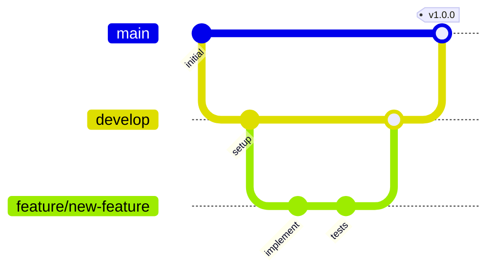

# Development Workflow

This document covers the development process, branching strategy, and contribution guidelines.

## Getting Started

### Prerequisites

- Node.js 18+
- PostgreSQL database
- npm or pnpm

### Setup

```bash
# Install dependencies
npm install

# Set up environment variables
cp .env.example .env
# Edit .env with your database and Clerk credentials

# Run database migrations
npx prisma migrate dev

# Start development server
npm run dev
```

## Development Commands

| Command                  | Purpose                                  |
| ------------------------ | ---------------------------------------- |
| `npm run dev`            | Start development server with hot reload |
| `npm run build`          | Build production bundle                  |
| `npm run test`           | Run test suite                           |
| `npm run lint`           | Run ESLint                               |
| `npx prisma studio`      | Open Prisma database GUI                 |
| `npx prisma migrate dev` | Apply database migrations                |

## Branching Strategy

### Branch Types

| Branch       | Purpose               | Example                  |
| ------------ | --------------------- | ------------------------ |
| `main`       | Production-ready code | -                        |
| `develop`    | Integration branch    | -                        |
| `feature/*`  | New features          | `feature/turbo-mode`     |
| `fix/*`      | Bug fixes             | `fix/task-status-update` |
| `refactor/*` | Code refactoring      | `refactor/hooks-cleanup` |

### Workflow



1. Create feature branch from `develop`
2. Implement changes with commits
3. Open PR to `develop`
4. Code review and approval
5. Merge to `develop`
6. Periodic releases merge `develop` to `main`

## Commit Conventions

Follow [Conventional Commits](https://www.conventionalcommits.org/):

```
<type>(<scope>): <description>

[optional body]

[optional footer]
```

### Types

| Type       | Description                |
| ---------- | -------------------------- |
| `feat`     | New feature                |
| `fix`      | Bug fix                    |
| `docs`     | Documentation              |
| `style`    | Formatting, no code change |
| `refactor` | Code restructuring         |
| `test`     | Adding tests               |
| `chore`    | Maintenance tasks          |

### Examples

```
feat(tasks): add turbo mode for bulk processing
fix(auth): handle expired session tokens
docs(readme): update installation instructions
refactor(hooks): extract common filter logic
```

## Code Review Guidelines

### For Authors

- Keep PRs focused and reasonably sized
- Write descriptive PR descriptions
- Respond to feedback constructively
- Ensure tests pass before requesting review

### For Reviewers

- Review within 24 hours when possible
- Be constructive and specific
- Approve when satisfied, don't nitpick
- Test locally if changes are significant

## Code Style

### TypeScript

- Use strict mode
- Prefer interfaces over types for object shapes
- Use explicit return types for functions
- Avoid `any`, use `unknown` when necessary

### React

- Functional components with hooks
- Extract complex logic to custom hooks
- Use meaningful component names
- Keep components focused and composable

### File Organization

```
feature/
├── components/       # React components
├── hooks/           # Custom hooks
├── lib/             # Utilities
├── types/           # TypeScript types
├── pages/           # Page components
└── index.ts         # Public exports
```

## Testing Guidelines

See [Testing Strategy](./testing-strategy.md) for detailed testing guidelines.

## Environment Variables

| Variable                | Description                          | Required |
| ----------------------- | ------------------------------------ | -------- |
| `DATABASE_URL`          | PostgreSQL connection string         | Yes      |
| `CLERK_PUBLISHABLE_KEY` | Clerk public key                     | Yes      |
| `CLERK_SECRET_KEY`      | Clerk secret key                     | Yes      |
| `NODE_ENV`              | Environment (development/production) | No       |

## Related Resources

- [Architecture Notes](./architecture.md)
- [Testing Strategy](./testing-strategy.md)
- [Tooling Guide](./tooling.md)
