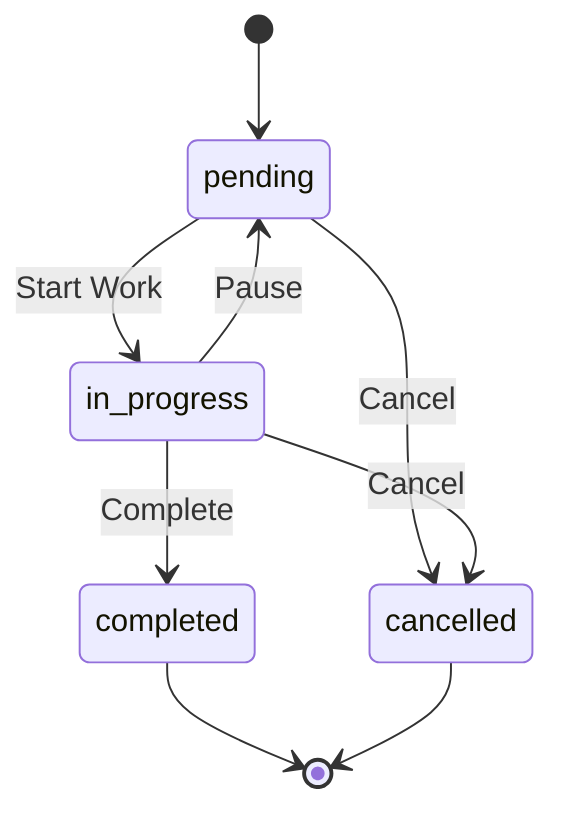

# Glossary & Domain Concepts

This document defines business terminology, domain concepts, and user personas for the Task Management System.

## Core Entities

### Task

A unit of work that needs to be completed. Tasks have:

- **Status**: pending, in_progress, completed, cancelled
- **Priority**: urgent, high, medium, low
- **Assignee**: User responsible for the task
- **Client**: Associated client (optional)
- **Due Date**: Target completion date

### Client

An external entity (company or individual) that the team works with:

- **Contact Information**: Name, email, phone
- **Address**: Physical location
- **Status**: active, inactive, pending
- **Meetings**: Associated meetings
- **Tasks**: Related tasks

### Meeting

A scheduled interaction with a client:

- **Type**: call, video, in_person
- **Status**: scheduled, completed, cancelled
- **Summary**: AI-generated or manual notes
- **Decisions**: Key decisions made
- **Action Items**: Follow-up tasks

### User

A system user with authentication and permissions:

- **Role**: admin, manager, user
- **Group**: Access group membership
- **Profile**: Name, email, avatar

## Domain Concepts

### Task Status Flow

### Priority Levels

| Priority | Description                   | SLA Guidance   |
| -------- | ----------------------------- | -------------- |
| Urgent   | Critical, immediate attention | Same day       |
| High     | Important, prioritize         | 1-2 days       |
| Medium   | Standard priority             | Within a week  |
| Low      | Can be deferred               | When available |

### Turbo Mode

A productivity feature that enables rapid task processing:

- Sequential task review
- Keyboard navigation
- Quick status updates
- Bulk processing workflow

### WhatsApp Groups

Integration feature linking tasks to WhatsApp communication groups:

- Track conversations related to tasks
- Link external communication to internal tracking
- Status tracking for group membership

## User Roles

### Admin

- Full system access
- User management capabilities
- System configuration
- All data visibility

### Manager

- Team oversight
- Task assignment
- Client management
- Reporting access

### User

- Own task management
- Client interaction
- Meeting participation
- Limited to assigned data

## Business Rules

### Task Assignment

1. Tasks can be assigned to any active user
2. Unassigned tasks are visible to all users
3. Only assignee or admin can complete a task
4. Task history tracks all changes

### Client Access

1. Clients are visible based on group membership
2. Admin sees all clients
3. Manager sees group clients
4. User sees assigned client tasks

### Meeting Scheduling

1. Meetings require a client association
2. Past meetings cannot be edited (except notes)
3. AI summaries are generated on demand
4. Action items can become tasks

## Technical Terms

| Term               | Definition                          |
| ------------------ | ----------------------------------- |
| **Prisma**         | TypeScript ORM for database access  |
| **TanStack Query** | Server state management library     |
| **Clerk**          | Authentication service provider     |
| **shadcn/ui**      | Component library based on Radix UI |
| **Vite**           | Frontend build tool and dev server  |
| **Express**        | Node.js web framework               |

## Abbreviations

| Abbreviation | Full Form                         |
| ------------ | --------------------------------- |
| API          | Application Programming Interface |
| CRUD         | Create, Read, Update, Delete      |
| JWT          | JSON Web Token                    |
| ORM          | Object-Relational Mapping         |
| SPA          | Single Page Application           |
| UI/UX        | User Interface / User Experience  |

## Related Resources

- [Project Overview](./project-overview.md)
- [Architecture Notes](./architecture.md)
- [Data Flow](./data-flow.md)
