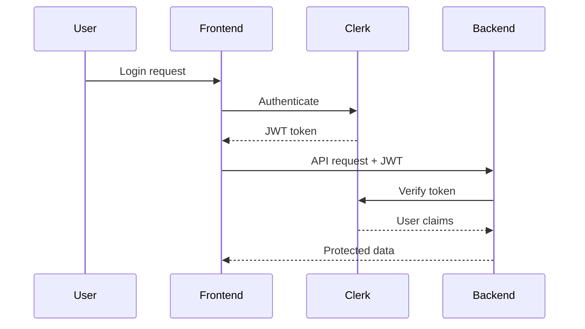

# Security & Compliance Notes

This document covers the security model, authentication, authorization, and compliance considerations.

## Authentication

### Clerk Integration

The system uses [Clerk](https://clerk.com) for user authentication:

- **Session Management**: JWT-based sessions with automatic refresh
- **Social Login**: Support for Google, GitHub, and other OAuth providers
- **Multi-factor Authentication**: Optional 2FA for enhanced security
- **Password Policies**: Configurable password requirements

### Authentication Flow



### Token Handling

- Tokens stored in HTTP-only cookies
- Automatic token refresh before expiration
- Secure token transmission via HTTPS
- Token revocation on logout

## Authorization

### Role-Based Access Control (RBAC)

| Role    | Capabilities                                       |
| ------- | -------------------------------------------------- |
| Admin   | Full system access, user management, configuration |
| Manager | Team management, client oversight, reporting       |
| User    | Own tasks, assigned clients, meeting participation |

### Permission Matrix

| Resource         | Admin | Manager     | User |
| ---------------- | ----- | ----------- | ---- |
| View all tasks   | Yes   | Yes (group) | No   |
| Create tasks     | Yes   | Yes         | Yes  |
| Assign tasks     | Yes   | Yes         | No   |
| Delete tasks     | Yes   | No          | No   |
| View all clients | Yes   | Yes (group) | No   |
| Create clients   | Yes   | Yes         | No   |
| Manage users     | Yes   | No          | No   |

### Middleware Implementation

```typescript
// server/auth.ts
export function requireRole(roles: string[]) {
  return (req, res, next) => {
    const userRole = req.auth?.sessionClaims?.role;
    if (!roles.includes(userRole)) {
      return res.status(403).json({ error: "Forbidden" });
    }
    next();
  };
}

export const requireAdmin = requireRole(["admin"]);
```

## Data Protection

### Database Security

- **Connection Encryption**: TLS for database connections
- **Credentials Management**: Environment variables for sensitive data
- **Query Parameterization**: Prisma prevents SQL injection
- **Access Control**: Database user with minimal required permissions

### API Security

- **CORS Configuration**: Restricted to allowed origins
- **Rate Limiting**: Protect against abuse (recommended)
- **Input Validation**: Server-side validation for all inputs
- **Error Handling**: Generic error messages to prevent information leakage

### Sensitive Data Handling

| Data Type      | Protection                 |
| -------------- | -------------------------- |
| Passwords      | Managed by Clerk (hashed)  |
| API Keys       | Environment variables only |
| User PII       | Access controlled by role  |
| Session Tokens | HTTP-only, secure cookies  |

## Security Headers

Recommended headers for production:

```typescript
// Security headers middleware
app.use((req, res, next) => {
  res.setHeader("X-Content-Type-Options", "nosniff");
  res.setHeader("X-Frame-Options", "DENY");
  res.setHeader("X-XSS-Protection", "1; mode=block");
  res.setHeader("Strict-Transport-Security", "max-age=31536000");
  next();
});
```

## Audit & Logging

### Activity Logging

- User authentication events (login, logout, failed attempts)
- Data modification events (create, update, delete)
- Administrative actions (user management, configuration)

### Task History

The `TaskHistory` entity tracks all task modifications:

- Who made the change
- When it occurred
- What changed (previous and new values)

## Compliance Considerations

### Data Retention

- User data retained while account is active
- Deleted users: Personal data removed, audit logs retained
- Meeting notes: Retained for business records

### Privacy

- Minimal data collection principle
- User consent for data processing
- Data export capability (GDPR compliance)
- Right to deletion support

## Security Checklist

### Development

- [ ] Never commit secrets to version control
- [ ] Use environment variables for configuration
- [ ] Validate and sanitize all user input
- [ ] Use parameterized queries (Prisma handles this)

### Deployment

- [ ] Enable HTTPS
- [ ] Configure security headers
- [ ] Set up rate limiting
- [ ] Enable logging and monitoring
- [ ] Regular dependency updates

### Operations

- [ ] Regular security audits
- [ ] Incident response plan
- [ ] Backup and recovery procedures
- [ ] Access review periodically

## Related Resources

- [Architecture Notes](./architecture.md)
- [Development Workflow](./development-workflow.md)
