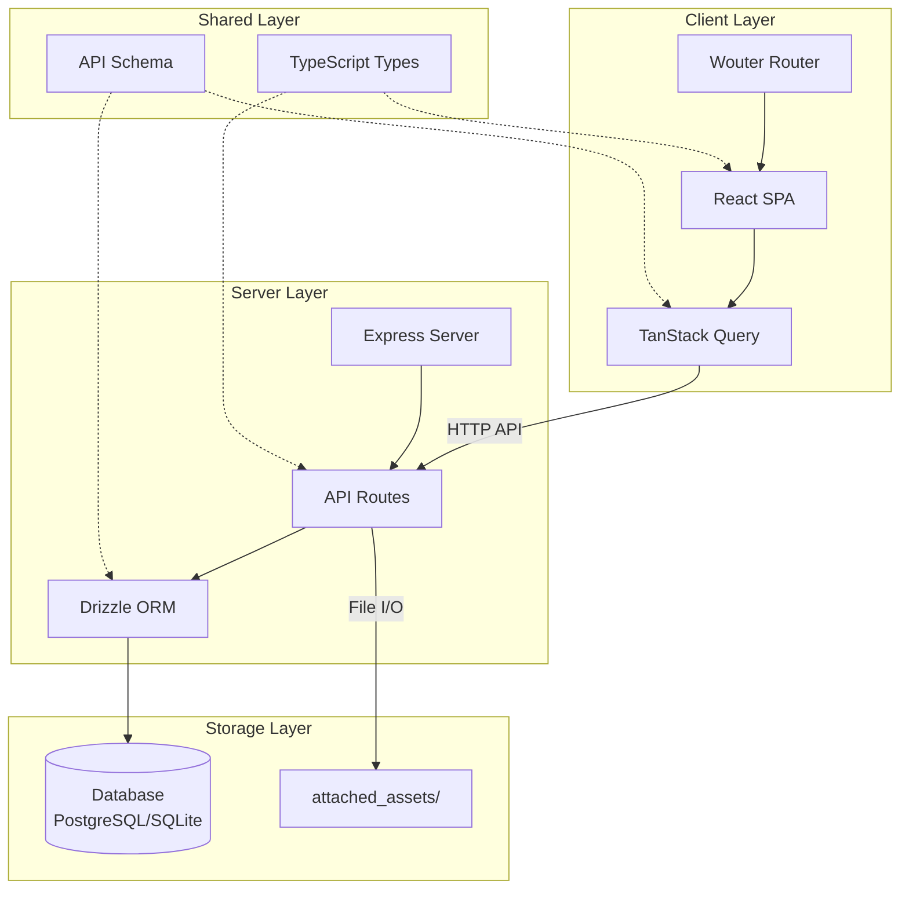
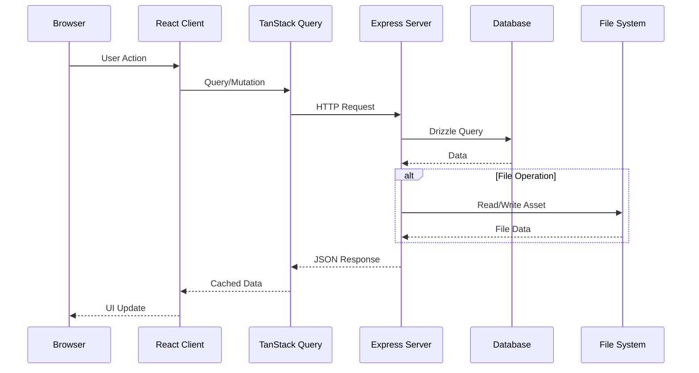

```markdown
<!-- agent-update:start:architecture-notes -->
# Architecture Notes

The system is a full-stack web application built as a monolith with distinct separation between frontend (client) and backend (server) layers, connected via a RESTful API. This design choice prioritizes simplicity and rapid development, suitable for a Replit-hosted environment, while allowing for future scalability by modularizing shared utilities and assets. The architecture evolved from a basic client-side app to include a lightweight server for data persistence and processing, driven by the need to handle user-attached assets securely and efficiently. Key influences include TypeScript for type safety across layers and Vite for fast frontend development.

## System Architecture Overview

The application follows a client-server model:

- **Frontend (Client Layer)**: A single-page application (SPA) built with Vite and TypeScript, handling user interface, state management, and API interactions. The client uses React with TanStack Query for server state management and Wouter for client-side routing.
- **Backend (Server Layer)**: A Node.js server using Express for routing and Drizzle ORM for database operations. The server provides RESTful endpoints under `/api/*` and serves the built client assets in production.
- **Deployment Model**: Designed for containerized or serverless deployment, with Replit as the primary hosting platform (see `replit.md` for setup). The application runs as a single process serving both API and static assets. Requests flow from the client browser to the server API endpoint, which queries the database and serves attached assets.
- **Request Flow**: User interactions in the client trigger HTTP requests to `/api/*` endpoints on the server. The server processes logic, interacts with the database via Drizzle, and returns JSON responses. Attached assets are stored and served from the `attached_assets/` directory or a mounted volume.

Control pivots occur at the API boundary, where client-side validation hands off to server-side authorization and persistence.

## Core System Components

| Directory | File Count | Purpose |
|-----------|------------|---------|
| `attached_assets/` | 279 | User-uploaded files, images, and attachments. Managed as a file system store with potential cloud sync in future iterations. |
| `client/` | 178 | Frontend codebase including React components, pages, hooks, and utilities. Uses Vite for bundling, Tailwind CSS and shadcn/ui for styling, and TypeScript throughout. |
| `server/` | 7 | Backend implementation with Express routes, Drizzle schemas, and business logic. Handles authentication, file uploads, and data queries. |
| `shared/` | 1 | Shared TypeScript types and schema definitions reusable across client and server to ensure API contract consistency. |

### Root Configuration Files

| File | Purpose |
|------|---------|
| `package.json` | Defines dependencies (Vite, Drizzle, Express, React, TanStack Query, Tailwind) and scripts for dev/build/start. |
| `tsconfig.json` | TypeScript configuration with path aliases (`@/`, `@shared/`, `@assets/`) for the monorepo. |
| `vite.config.ts` | Frontend build configuration with React plugin, path resolution, and dev server proxy to backend. |
| `tailwind.config.ts` | Tailwind CSS theme customization and content paths. |
| `postcss.config.js` | PostCSS pipeline for Tailwind processing. |
| `drizzle.config.ts` | Database migration and schema management configuration. |
| `components.json` | shadcn/ui component registry configuration. |
| `design_guidelines.md` | Project styling and coding standards. |
| `replit.md` | Deployment instructions and Replit-specific configuration. |

## Internal System Boundaries

- **Client-Server Seam**: Enforced via TypeScript types in `shared/`. The client owns UI state (React hooks, TanStack Query cache), while the server owns data persistence and file storage. No direct database access from client.
- **Bounded Contexts**:
  - **Asset Management**: `attached_assets/` directory and server upload handlers.
  - **User Interface**: `client/` domain with React components and pages.
  - **Data Layer**: Server routes + Drizzle schemas + PostgreSQL/SQLite.
- **Data Ownership & Sync**: Server owns all persistent data via Drizzle ORM. TanStack Query handles client-side caching with configurable stale times. Shared TypeScript interfaces prevent API contract drift.
- **Enforcement**: TypeScript strict mode and path aliases in `tsconfig.json` ensure boundary adherence. ESLint rules prevent cross-boundary imports.

## System Integration Points

### Inbound Interfaces

| Endpoint Pattern | Owner | Description |
|------------------|-------|-------------|
| `/api/*` | `server/routes.ts` | RESTful API for all data operations |
| `/api/assets` | Server | CRUD operations for attachments |
| `/api/users` | Server | User management endpoints |
| `/*` (static) | Server | Serves built client assets in production |

### File Upload Flow

1. Client sends multipart form data to `/api/upload`
2. Server validates file type and size
3. File stored to `attached_assets/` with generated filename
4. Database record created via Drizzle
5. Asset URL returned to client

### Orchestration

- Server coordinates database writes (Drizzle) and file I/O sequentially
- Client fetches assets via API; server serves static files from `attached_assets/`
- No complex event-driven flows; simple request-response pattern

## External Service Dependencies

| Service | Technology | Configuration | Failure Handling |
|---------|------------|---------------|------------------|
| Database | PostgreSQL (production) / SQLite (development) | Drizzle ORM, connection via `DATABASE_URL` env var | Retry logic in queries; graceful error responses |
| Styling | Tailwind CSS + shadcn/ui | Local build, no CDN | N/A (build-time) |
| Build Tools | Vite, esbuild, Node.js 20+ | Local runtime | CI validation |
| Hosting | Replit | Secrets for env vars, `.replit` config | Graceful degradation to read-only mode |

### Future Considerations

- Cloud storage (S3, Cloudflare R2) for `attached_assets/` to handle scale
- CDN for static asset delivery
- WebSocket support for real-time features

## Key Decisions & Trade-offs

| Decision | Rationale | Trade-off | Status |
|----------|-----------|-----------|--------|
| **Monolith architecture** | Low operational overhead for small team/Replit setup | Easier debugging but potential scaling bottlenecks | Active |
| **TypeScript everywhere** | Shared type safety reduces runtime errors | Slightly longer build times | Active |
| **Drizzle ORM** | Type-safe queries, simpler migrations than Prisma, lighter footprint | Less ecosystem tooling | Active |
| **Vite + React** | Fast HMR, modern bundling, smaller bundle than Next.js | No SSR (client-only rendering) | Active |
| **Tailwind + shadcn/ui** | Utility-first CSS with accessible component primitives | Larger HTML output, learning curve | Active |
| **File-based assets** | Simple local storage, no vendor lock-in | Manual backups required, disk quota limits | Active |
| **TanStack Query** | Declarative server state, automatic caching/revalidation | Additional abstraction layer | Active |

Supporting docs: [Design Guidelines](../design_guidelines.md), [Project Overview](./project-overview.md)

## Diagrams

### System Architecture



### Request Flow



## Risks & Constraints

### Performance Risks

| Risk | Impact | Mitigation |
|------|--------|------------|
| Server bottleneck under load | High latency, dropped requests | Monitor response times; consider horizontal scaling |
| Large asset uploads | Memory pressure, timeout | Streaming uploads, file size limits |
| Database connection limits | Failed queries | Connection pooling via Drizzle |

### Scaling Constraints

- **Concurrent Users**: Architecture supports ~100 concurrent users; beyond requires infrastructure changes
- **Asset Storage**: `attached_assets/` currently at 279 files; monitor disk usage, plan cloud migration at 1GB
- **Replit Limits**: CPU/RAM quotas; upgrade plan or migrate for production scale

### Security Considerations

- **File Uploads**: Validate file types, scan for malicious content, sanitize filenames
- **API Authentication**: Implement session-based or JWT auth for protected routes
- **Database**: Use parameterized queries (Drizzle default), rotate credentials

### Technical Debt

| Item | Priority | Notes |
|------|----------|-------|
| WebSocket integration | Medium | Required for real-time features |
| Cloud asset storage | Medium | Needed before disk quota exceeded |
| API rate limiting | Low | Implement if abuse detected |
| Comprehensive error boundaries | Low | Improve client-side error handling |

## Repository Statistics

| Metric | Value |
|--------|-------|
| Total Files | 476 |
| Repository Size | ~18.21 MB |
| Top Directory | `attached_assets/` (279 files) |
| Client Files | 178 |
| Server Files | 7 |
| Shared Files | 1 |

<!-- agent-readonly:guidance -->
## AI Update Checklist

1. Review ADRs, design docs, or major PRs for architectural changes.
2. Verify that each documented decision still holds; mark superseded choices clearly.
3. Capture upstream/downstream impacts (APIs, events, data flows).
4. Update Risks & Constraints with active incident learnings or TODO debt.
5. Link any new diagrams or dashboards referenced in recent work.

<!-- agent-readonly:sources -->
## Acceptable Sources

- ADR folders, `/docs/architecture` notes, or RFC threads.
- Dependency visualizations from build tooling or scripts.
- Issue tracker discussions vetted by maintainers.

## Related Resources

- [Project Overview](./project-overview.md)
- [Design Guidelines](../design_guidelines.md)
- [Replit Configuration](../replit.md)
- Update [agents/README.md](../agents/README.md) when architecture changes.

<!-- agent-update:end -->
```
