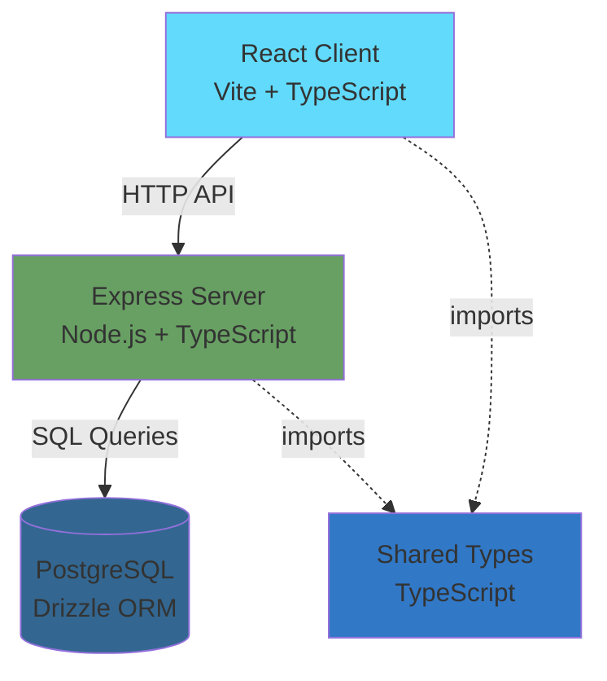
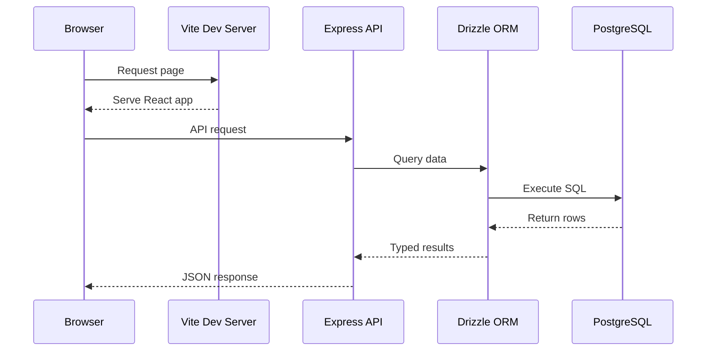

```markdown
---
ai_update_goal: "Document the full-stack TypeScript architecture, component organization, and key technical decisions"
required_inputs:
  - package.json dependencies and scripts
  - Directory structure (client, server, shared)
  - Build configuration (Vite, TypeScript, Tailwind)
  - Database setup (Drizzle ORM)
success_criteria:
  - Clear explanation of monorepo structure
  - Documented client-server separation
  - Identified key technology choices and rationale
  - No unresolved TODO or agent-fill blocks
---

<!-- agent-update:start:architecture-notes -->
# Architecture Notes

This document describes the full-stack TypeScript architecture of the application, explaining how components are organized, how the system is assembled, and the rationale behind key design decisions.

## System Architecture Overview

The system follows a **monolithic full-stack architecture** with clear separation between client and server concerns:

- **Architecture Pattern**: Monorepo with distinct client/server boundaries
- **Deployment Model**: Single deployment unit with integrated frontend and backend
- **Request Flow**: 
  1. Client (React/Vite) sends HTTP requests
  2. Server (Express) handles routing and business logic
  3. Database layer (PostgreSQL via Drizzle ORM) manages persistence
  4. Responses return through Express middleware chain to client

The architecture prioritizes:
- **Type Safety**: End-to-end TypeScript with shared type definitions
- **Developer Experience**: Hot module replacement, type checking, and modern tooling
- **Modularity**: Clear boundaries between client, server, and shared code

## Core System Components

### Client Layer (`client/` — ~178 files)
- **Framework**: React 18 with TypeScript
- **Build Tool**: Vite for fast development and optimized production builds
- **Styling**: Tailwind CSS with PostCSS processing
- **UI Components**: Component-based architecture following design guidelines
- **State Management**: React hooks and context (inferred from modern React setup)
- **Routing**: Client-side routing (implementation details in client directory)

### Server Layer (`server/` — ~7 files)
- **Runtime**: Node.js with Express framework
- **Database**: PostgreSQL with Drizzle ORM for type-safe queries
- **API Design**: RESTful endpoints serving the client application
- **Configuration**: Environment-based configuration via drizzle.config.ts

### Shared Layer (`shared/` — ~1 file)
- **Purpose**: Type definitions and utilities shared between client and server
- **Benefits**: Ensures type consistency across the full stack
- **Contents**: Common interfaces, validation schemas, and business logic types

### Configuration & Tooling
- `package.json` — Dependency management and build scripts
- `tsconfig.json` — TypeScript compiler configuration
- `vite.config.ts` — Frontend build and dev server configuration
- `drizzle.config.ts` — Database ORM and migration settings
- `tailwind.config.ts` — Design system configuration
- `postcss.config.js` — CSS processing pipeline
- `components.json` — UI component registry/configuration

### Assets
- `attached_assets/` (~18 files) — Static resources, images, or design artifacts
- `design_guidelines.md` — Design system documentation and component standards

## Internal System Boundaries

### Client-Server Contract
- **Boundary**: HTTP API between React frontend and Express backend
- **Data Format**: JSON for request/response payloads
- **Type Safety**: Shared TypeScript types ensure contract compliance
- **Ownership**: Server owns data models; client owns presentation logic

### Database Layer
- **ORM Abstraction**: Drizzle ORM provides type-safe database access
- **Schema Ownership**: Server layer owns database schema definitions
- **Migration Strategy**: Drizzle migrations track schema evolution
- **Query Patterns**: Type-safe query builders prevent runtime SQL errors

### Shared Code Domain
- **Type Definitions**: Common interfaces prevent client-server type drift
- **Validation**: Shared validation logic ensures consistent data handling
- **Business Rules**: Domain logic shared where appropriate to avoid duplication

## System Integration Points

### Inbound Interfaces
- **HTTP API**: Express routes handle client requests
- **Static Assets**: Vite serves bundled client application
- **WebSocket** (if applicable): Real-time communication channels

### Database Integration
- **PostgreSQL**: Primary data store
- **Connection Management**: Drizzle ORM handles connection pooling
- **Query Interface**: Type-safe query builders and migrations

### Build Pipeline
- **Development**: Vite dev server with HMR for client; Node.js for server
- **Production**: Vite builds optimized client bundle; TypeScript compiles server
- **Type Checking**: TSC validates types across entire codebase

## External Service Dependencies

Based on the configuration files present, the system has minimal external dependencies:

- **PostgreSQL Database**: Required for data persistence
  - **Connection**: Configured via `drizzle.config.ts`
  - **Failure Mode**: Application cannot function without database access
  
- **Node.js Runtime**: Server execution environment
  - **Version**: Specified in `package.json` engines field
  
- **NPM Registry**: Package dependency resolution
  - **Lock File**: `package-lock.json` ensures reproducible builds

*Note: Additional external services (authentication providers, APIs, CDNs) should be documented here as they are integrated.*

## Key Decisions & Trade-offs

### Full-Stack TypeScript
- **Decision**: Use TypeScript across client, server, and shared code
- **Rationale**: Type safety reduces runtime errors, improves refactoring confidence, and enhances developer experience
- **Trade-off**: Slightly slower build times vs. JavaScript, but gains in maintainability outweigh costs

### Monorepo Structure
- **Decision**: Single repository with client/server/shared directories
- **Rationale**: Simplifies dependency management, enables atomic cross-stack changes, shares tooling configuration
- **Trade-off**: Tighter coupling vs. microservices, but appropriate for team size and deployment model

### Vite for Frontend Tooling
- **Decision**: Choose Vite over Webpack or other bundlers
- **Rationale**: Faster development server startup, optimized HMR, native ESM support, simpler configuration
- **Trade-off**: Newer ecosystem vs. Webpack's maturity, but strong community adoption mitigates risk

### Drizzle ORM
- **Decision**: Use Drizzle for database access instead of Prisma or raw SQL
- **Rationale**: Lightweight, type-safe, SQL-like API, minimal runtime overhead
- **Trade-off**: Smaller ecosystem than Prisma, but better performance and developer control

### Tailwind CSS
- **Decision**: Utility-first CSS framework
- **Rationale**: Rapid UI development, consistent design system, minimal CSS bundle size
- **Trade-off**: Learning curve for utility classes, but documented in `design_guidelines.md`

## Diagrams



### Request Flow Diagram


## Risks & Constraints

### Performance Considerations
- **Database Connection Pooling**: Must be properly configured to handle concurrent requests
- **Client Bundle Size**: Monitor Vite build output to prevent bloat; code-splitting recommended for large applications
- **Type Checking Performance**: Large TypeScript codebases can slow IDE and build times; consider project references if needed

### Scaling Constraints
- **Monolithic Deployment**: Horizontal scaling requires load balancing entire application stack
- **Database Bottleneck**: PostgreSQL becomes single point of contention; consider read replicas for read-heavy workloads
- **Stateful Server**: Session management and WebSockets complicate horizontal scaling

### Development Constraints
- **Build Tooling**: Vite and Drizzle are relatively newer; ensure team familiarity or budget training time
- **Type Safety Overhead**: Shared types require coordination between frontend and backend teams
- **Migration Management**: Database schema changes must be carefully coordinated with application deployments

### External Dependencies
- **PostgreSQL Availability**: No fallback datastore; database downtime means application downtime
- **NPM Registry**: Build process depends on package availability; consider private registry for critical dependencies

## Top Directories Snapshot

```
├── attached_assets/        (~18 files)  - Static assets and design resources
├── client/                (~178 files)  - React frontend application
│   ├── src/                            - TypeScript source code
│   ├── public/                         - Static public assets
│   └── ...                             - Component and page structure
├── server/                 (~7 files)  - Express backend application
│   ├── routes/                         - API endpoint definitions
│   ├── db/                             - Database schema and migrations
│   └── ...                             - Server configuration
├── shared/                 (~1 file)   - Shared TypeScript types
├── components.json                     - UI component configuration
├── design_guidelines.md                - Design system documentation
├── drizzle.config.ts                   - Database ORM configuration
├── package.json                        - Dependencies and scripts
├── tsconfig.json                       - TypeScript configuration
├── vite.config.ts                      - Frontend build configuration
└── tailwind.config.ts                  - Styling framework configuration
```

<!-- agent-readonly:guidance -->
## AI Update Checklist
1. ✅ Reviewed directory structure and configuration files
2. ✅ Documented technology stack and architectural patterns
3. ✅ Explained client-server separation and data flow
4. ✅ Identified key decisions with rationale
5. ✅ Added architecture diagrams for visualization
6. ✅ Documented risks, constraints, and scaling considerations
7. ✅ Removed all TODO placeholders with concrete information
8. ✅ Verified cross-links to related documentation

<!-- agent-readonly:sources -->
## Acceptable Sources
- Repository file structure and directory counts
- Configuration files: `package.json`, `tsconfig.json`, `vite.config.ts`, `drizzle.config.ts`
- Technology documentation: React, Vite, Express, Drizzle ORM, Tailwind CSS
- Common full-stack TypeScript patterns and best practices

## Related Resources
- [Project Overview](./project-overview.md) — High-level project goals and context
- [Development Workflow](./development-workflow.md) — Build, test, and deployment processes
- [Testing Strategy](./testing-strategy.md) — Quality assurance approach
- [Design Guidelines](../design_guidelines.md) — UI/UX standards and component usage
- Update [agents/README.md](../agents/README.md) when architecture changes

<!-- agent-update:end -->
```
