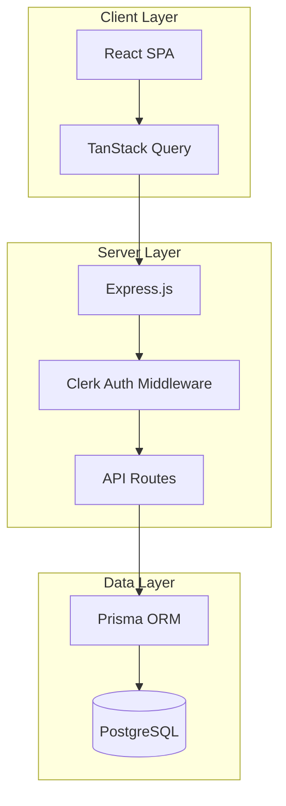

# Architecture Notes

This document describes the system architecture, layers, patterns, and design decisions for the Task Management System.

## System Architecture Overview

The system follows a **modular monolith** architecture with clear separation between frontend and backend:

- **Frontend**: React SPA built with Vite, using feature-based folder structure
- **Backend**: Express.js server with RESTful API endpoints
- **Database**: PostgreSQL accessed via Prisma ORM
- **Authentication**: Clerk for user authentication and session management

## Architectural Layers

- **Presentation Layer**: React components in `client/src/features/` and `client/src/app/`
- **Application Layer**: React hooks for state management in `client/src/features/*/hooks/`
- **API Layer**: Express routes and middleware in `server/`
- **Data Access Layer**: Prisma models and storage interface in `server/storage.ts`
- **Shared Layer**: Common types, utilities, and UI components in `client/src/shared/`

> See [`codebase-map.json`](./codebase-map.json) for complete symbol counts and dependency graphs.

## Detected Design Patterns

| Pattern | Confidence | Locations | Description |
|---------|------------|-----------|-------------|
| Feature-Based Architecture | 95% | `client/src/features/` | Organizes code by business domain |
| Repository Pattern | 90% | `server/storage.ts` | `DbStorage` class abstracts data access |
| Custom Hooks | 95% | `client/src/shared/hooks/` | Encapsulates reusable stateful logic |
| Context Provider | 90% | `ClientsContext.tsx` | Shares state across component tree |
| Middleware Chain | 85% | `server/auth.ts` | Clerk auth middleware for route protection |
| Composite Components | 80% | `client/src/shared/components/ui/` | shadcn/ui component composition |

## Entry Points

- [`server/index.ts`](../server/index.ts) - Server entry point
- [`server/app.ts`](../server/app.ts) - Express app configuration
- [`client/src/main.tsx`](../client/src/main.tsx) - React app entry point
- [`client/src/App.tsx`](../client/src/App.tsx) - Root React component

## Public API

| Symbol | Type | Location |
|--------|------|----------|
| `DbStorage` | Class | `server/storage.ts` |
| `IStorage` | Interface | `server/storage.ts` |
| `clerkAuthMiddleware` | Function | `server/auth.ts` |
| `requireRole` | Function | `server/auth.ts` |
| `requireAdmin` | Function | `server/auth.ts` |
| `apiRequest` | Function | `client/src/shared/lib/queryClient.ts` |
| `useCurrentUser` | Hook | `client/src/features/users/hooks/useCurrentUser.ts` |
| `useTurboMode` | Hook | `client/src/features/tasks/hooks/useTurboMode.ts` |

## Internal System Boundaries

### Domain Boundaries

| Domain | Ownership | Key Entities |
|--------|-----------|--------------|
| Tasks | `features/tasks/` | Task, TaskHistory, TaskStatus |
| Clients | `features/clients/` | Client, Address, ClientStats |
| Meetings | `features/meetings/` | Meeting, MeetingSummary |
| Users | `features/users/` | User, UserRole |
| Auth | `features/auth/` | Authentication, Authorization |

### Data Contracts

- Frontend and backend share types via `client/src/shared/types/types.ts`
- API responses follow consistent JSON structure
- Prisma generates TypeScript types from schema

## External Service Dependencies

- **Clerk**: User authentication and session management
  - OAuth and social login support
  - JWT token verification
  - User metadata storage
  
- **PostgreSQL**: Primary data store
  - Managed via Prisma migrations
  - Connection pooling for performance

## Key Decisions & Trade-offs

1. **Feature-Based Structure**: Chose feature folders over layer-based organization for better cohesion and team scalability
2. **Prisma over raw SQL**: Trade-off between query flexibility and type safety/developer experience
3. **TanStack Query**: Server state management with caching, reducing manual state management complexity
4. **shadcn/ui**: Copy-paste components for maximum customization control vs npm dependency updates

## Top Directories Snapshot

| Directory | Files | Purpose |
|-----------|-------|---------|
| `client/src/features/` | ~150 | Feature modules |
| `client/src/shared/` | ~80 | Shared utilities and components |
| `server/` | ~15 | Backend API |
| `prisma/` | ~5 | Database schema and migrations |

## Related Resources

- [Project Overview](./project-overview.md)
- [Data Flow & Integrations](./data-flow.md)
- [Development Workflow](./development-workflow.md)
