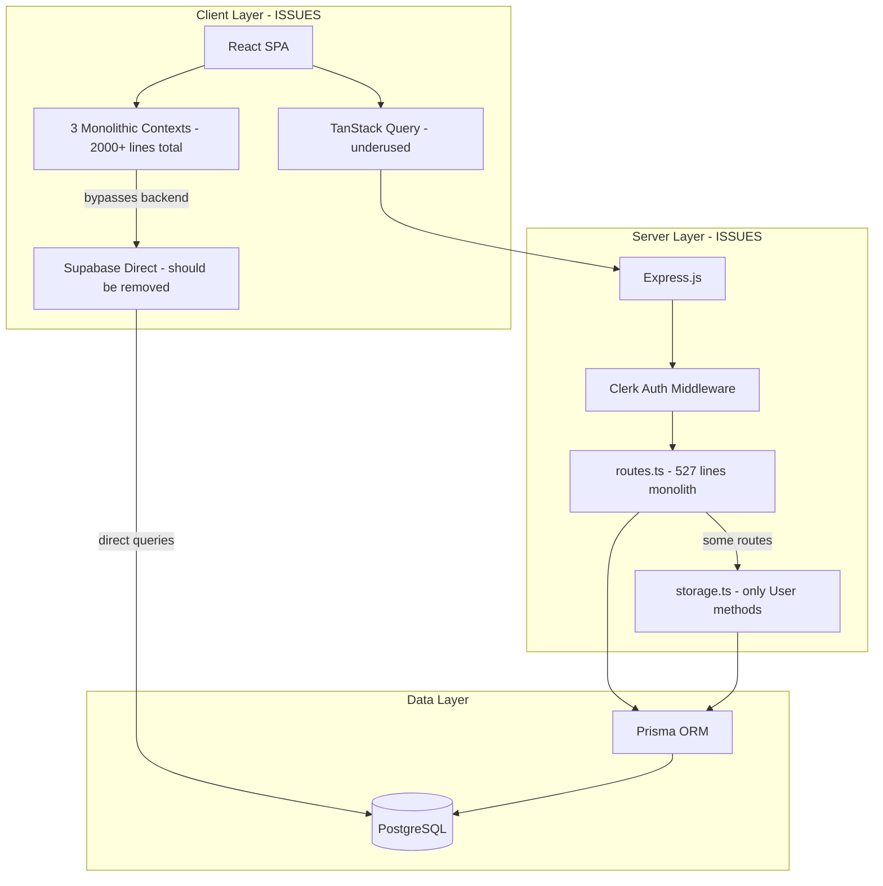

# Architecture

This document outlines the architecture of the application, detailing its structure, layers, design patterns, and key dependencies.

## System Architecture Overview

The system is designed as a **modular monolith**, with a clear separation between the frontend and backend components.

-   **Frontend**: A React Single Page Application (SPA) built using Vite, organized by features.
-   **Backend**: An Express.js server providing a RESTful API.
-   **Database**: PostgreSQL, accessed and managed through Prisma ORM.
-   **Authentication**: Clerk is utilized for user authentication and session management.


## Architectural Layers

The application is structured into distinct layers to ensure maintainability and scalability:

-   **Presentation Layer**: Contains the React components responsible for the UI, primarily located in `client/src/features/` and `client/src/app/`.
-   **Application Layer**: Encompasses React hooks used for state management and business logic, found in `client/src/features/*/hooks/`.
-   **API Layer**: Houses the Express routes and middleware for handling API requests, located in the `server/` directory.
-   **Data Access Layer**: Manages database interactions through Prisma models and the storage interface defined in `server/storage.ts`.
-   **Shared Layer**: A collection of reusable utilities, common types, and UI components, centralized in `client/src/shared/`.

For a detailed breakdown of file counts and dependency relationships, refer to the [`codebase-map.json`](./codebase-map.json) file.

## Detected Design Patterns

The following design patterns have been identified:

| Pattern                   | Confidence | Locations                                 | Description                                                        |
| :------------------------ | :--------- | :---------------------------------------- | :----------------------------------------------------------------- |
| Feature-Based Architecture | 95%        | `client/src/features/`                    | Code is organized around business domains (features).              |
| Repository Pattern        | 90%        | `server/storage.ts`                       | The `DbStorage` class abstracts data access operations.            |
| Custom Hooks              | 95%        | `client/src/shared/hooks/`                | Reusable stateful logic is encapsulated in custom React hooks.     |
| Context Provider          | 90%        | `client/src/features/clients/contexts/ClientsContext.tsx` | State is shared across the component tree using React Context.     |
| Middleware Chain          | 85%        | `server/auth.ts`                          | Clerk authentication middleware is used for route protection.      |
| Composite Components      | 80%        | `client/src/shared/components/ui/`        | Components from `shadcn/ui` are composed for UI elements.          |

## Entry Points

The primary entry points for the application are:

-   **Server**:
    -   [`server/index.ts`](../server/index.ts): Main server startup script.
    -   [`server/app.ts`](../server/app.ts): Express application configuration.
-   **Client**:
    -   [`client/src/main.tsx`](../client/src/main.tsx): React application initialization.
    -   [`client/src/App.tsx`](../client/src/App.tsx): Root React component.

## Public API

The following symbols are exported and can be considered part of the public API of their respective modules:

| Symbol                 | Type     | Location                               |
| :--------------------- | :------- | :------------------------------------- |
| `DbStorage`            | Class    | `server/storage.ts`                    |
| `IStorage`             | Interface | `server/storage.ts`                    |
| `clerkAuthMiddleware`  | Function | `server/auth.ts`                       |
| `requireRole`          | Function | `server/auth.ts`                       |
| `requireAdmin`         | Function | `server/auth.ts`                       |
| `apiRequest`           | Function | `client/src/shared/lib/queryClient.ts` |
| `useCurrentUser`       | Hook     | `client/src/features/users/hooks/useCurrentUser.ts` |
| `useTurboMode`         | Hook     | `client/src/features/tasks/hooks/useTurboMode.ts` |

## Internal System Boundaries

### Domain Boundaries

The application is divided into the following core domains:

| Domain   | Primary Location        | Key Entities                               |
| :------- | :---------------------- | :----------------------------------------- |
| Tasks    | `features/tasks/`       | Task, TaskHistory, TaskStatus              |
| Clients  | `features/clients/`     | Client, Address, ClientStats               |
| Meetings | `features/meetings/`    | Meeting, MeetingSummary                    |
| Users    | `features/users/`       | User, UserRole                             |
| Auth     | `features/auth/`        | Authentication, Authorization              |

### Data Contracts

-   **Cross-layer Communication**: Frontend and backend share common data structures defined in `client/src/shared/types/types.ts`.
-   **API Responses**: All API responses adhere to a consistent JSON structure.
-   **Database Schema**: Prisma automatically generates TypeScript types from the database schema, ensuring type safety.

## External Service Dependencies

The application relies on the following external services:

-   **Clerk**:
    -   Handles user authentication, including OAuth and social logins.
    -   Manages user sessions and JWT token verification.
    -   Stores user metadata.
-   **PostgreSQL**:
    -   Serves as the primary data persistence layer.
    -   Database schema and migrations are managed using Prisma.

## Key Decisions & Trade-offs

-   **Feature-Based Structure**: Chosen over a layer-based organization to enhance code cohesion and improve team scalability.
-   **Prisma for Data Access**: Prioritized type safety and developer experience over the flexibility of raw SQL queries.
-   **TanStack Query for Server State**: Utilized for robust server state management, including caching, which simplifies manual state handling.
-   **shadcn/ui for Components**: Opted for copy-pasting `shadcn/ui` components to achieve maximum customization control, accepting the trade-off of not automatically benefiting from upstream npm dependency updates.

## Top Directories Snapshot

A high-level overview of the project's key directories:

| Directory               | Files     | Purpose                               |
| :---------------------- | :-------- | :------------------------------------ |
| `client/src/features/`  | ~150      | Contains modules for each application feature. |
| `client/src/shared/`    | ~80       | Houses shared utilities and UI components. |
| `server/`               | ~15       | Backend API implementation.           |
| `prisma/`               | ~5        | Database schema and migration files.  |

---

## Audit Findings (2026-02-08)

### Known Architectural Issues

The following issues were identified during a comprehensive audit. See `.context/plans/software-audit.md` for the full report.

#### Critical

| Issue | Location | Status |
|-------|----------|--------|
| `DEV_BYPASS_AUTH` flag hardcoded in production code | `App.tsx:125` | Open |

#### High Severity

| Issue | Location |
|-------|----------|
| **Backend monolitico**: All 11 endpoints in single `routes.ts` (527 lines), no controllers/services/validators | `server/routes.ts` |
| **Provider Hell**: 3 nested contexts (Users>Clients>Tasks) without memoization, causing cascade re-renders | `App.tsx:84-120` |
| **TasksContext monolitico**: 767 lines, 15+ responsibilities (CRUD, history, undo/redo, Supabase sync, optimistic updates) | `TasksContext.tsx` |
| **ClientsContext monolitico**: 1002 lines, 30+ duplicate update methods | `ClientsContext.tsx` |
| **Circular imports**: Tasks<->Clients bidirectional dependency (25+ files) | Cross-feature |
| **Inconsistent data flow**: 3 patterns coexist (Express+Prisma, Context+Supabase direct, components+Supabase) | Multiple |

#### Dependency Graph Issues

```
tasks ──imports──> clients (10+ files: useClients, types)
clients ──imports──> tasks (15+ files: statusConfig, types, useTasks, components)
meetings ──imports──> tasks (1 file: SingleAssigneeSelector - should be in shared/)
meetings ──imports──> clients (1 file: useClients)
```

**Recommended fix**: Extract shared domain types to `@shared/types/domain.ts`, move `statusConfig.ts` to `@shared/lib/`.

#### Data Flow Architecture (Current vs Recommended)

**Current** (3 conflicting patterns):
```
Pattern 1: Admin pages → Express API → Prisma → DB
Pattern 2: Tasks/Clients → React Context → Supabase direct → DB (bypasses backend)
Pattern 3: Meetings → Components → Supabase direct → DB (no caching)
```

**Recommended** (single pattern):
```
Components → React Query → Express API → Prisma → DB
Context reserved for UI state only (filters, selection, modals)
```

### Architecture Diagram (Updated)



## Related Resources

-   [Project Overview](./project-overview.md)
-   [Data Flow & Integrations](./data-flow.md)
-   [Development Workflow](./development-workflow.md)
-   [Software Audit Report](../plans/software-audit.md)
