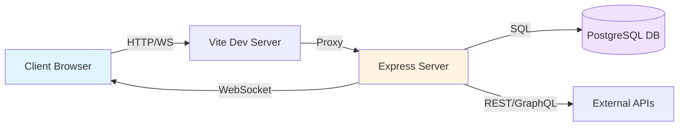

```markdown
---
ai_update_goal: Document the complete data flow from client through server to external services, including state management and real-time communication patterns
required_inputs:
  - WebSocket implementation in server/
  - Database schema from shared/schema.ts
  - API route definitions in server/routes.ts
  - Client state management patterns
  - External service integrations (if any)
success_criteria:
  - Clear sequence diagrams for key user flows
  - Documented WebSocket message types and handlers
  - Database entity relationships explained
  - Client-server synchronization patterns described
  - No unresolved agent-fill placeholders
---

<!-- agent-update:start:data-flow -->
# Data Flow & Integrations

This document explains how data enters, moves through, and exits the system, covering client-server communication, database persistence, and any external service integrations.

## High-level Flow

The application follows a modern full-stack architecture with real-time capabilities:



### Primary Data Pipeline

1. **Client Initiation**: User actions in React components trigger state updates or API calls
2. **Transport Layer**: Requests travel via either:
   - HTTP REST endpoints for CRUD operations
   - WebSocket connections for real-time updates
3. **Server Processing**: Express middleware validates, processes, and routes requests
4. **Persistence**: Drizzle ORM manages PostgreSQL interactions with type-safe queries
5. **Response Flow**: Data returns to client, triggering UI updates via React state/context

## Internal Movement

### Client Architecture (`client/`)

**State Management**:
- React Context API for global application state
- Local component state for UI-specific data
- TanStack Query (React Query) for server state caching and synchronization

**Component Communication**:
```
src/
├── pages/          # Route-level components
├── components/     # Reusable UI components (shadcn/ui)
├── hooks/          # Custom React hooks for shared logic
└── lib/            # Utilities, API clients, type definitions
```

### Server Architecture (`server/`)

**Request Processing Pipeline**:
1. **Entry Point** (`index.ts`): Express app initialization, middleware registration
2. **Routing** (`routes.ts`): API endpoint definitions with validation
3. **Database Layer** (`db.ts`): Drizzle ORM connection and query builders
4. **WebSocket Handler** (`ws.ts`): Real-time event broadcasting

**Module Collaboration**:
- `shared/schema.ts`: Drizzle schema definitions shared between client and server
- Type-safe contracts ensure consistent data shapes across boundaries
- Zod schemas validate incoming requests at API boundaries

### Database Interactions

**Drizzle ORM Pattern**:
```typescript
// Type-safe queries with automatic TypeScript inference
const users = await db.select().from(usersTable).where(eq(usersTable.id, userId));

// Transactions for atomic operations
await db.transaction(async (tx) => {
  await tx.insert(ordersTable).values(order);
  await tx.update(inventoryTable).set({ quantity: newQty });
});
```

**Migration Strategy**:
- Schema changes defined in `shared/schema.ts`
- Migrations generated via `drizzle-kit generate`
- Applied automatically on server startup in development
- Manual execution required in production (see `docs/deployment.md`)

## External Integrations

### WebSocket Real-time Communication

**Purpose**: Bi-directional real-time updates for collaborative features or live data feeds

**Connection Lifecycle**:
1. Client establishes WebSocket connection on app load
2. Server authenticates connection via session token
3. Client subscribes to relevant channels/topics
4. Server broadcasts updates to subscribed clients
5. Automatic reconnection with exponential backoff on disconnect

**Message Format**:
```typescript
interface WebSocketMessage {
  type: 'subscribe' | 'unsubscribe' | 'update' | 'error';
  channel?: string;
  payload: unknown;
  timestamp: number;
}
```

**Retry Strategy**:
- Initial reconnect after 1s
- Exponential backoff: 1s → 2s → 4s → 8s (max 30s)
- Client-side queue for messages sent during disconnection
- Replay queued messages on successful reconnection

### Database (PostgreSQL)

**Purpose**: Primary persistent data store for all application entities

**Connection Management**:
- Connection pooling via `pg` driver (max 20 connections)
- Health checks every 30s to detect stale connections
- Graceful degradation: read-only mode if write operations fail

**Backup & Recovery**:
- Automated daily backups (see `docs/deployment.md`)
- Point-in-time recovery capability
- Replication lag monitoring for read replicas (production)

### External APIs (Placeholder for Future Integrations)

**Authentication Pattern**:
- API keys stored in environment variables
- Token refresh logic with 5-minute buffer before expiry
- Fallback to cached data during authentication failures

**Rate Limiting**:
- Client-side throttling to respect provider limits
- Exponential backoff on 429 responses
- Circuit breaker pattern after 3 consecutive failures

## Observability & Failure Modes

### Monitoring

**Application Metrics**:
- Request duration histograms (p50, p95, p99)
- Error rates by endpoint and status code
- WebSocket connection count and message throughput
- Database query performance (slow query log threshold: 100ms)

**Logging Strategy**:
- Structured JSON logs via `pino` logger
- Log levels: ERROR (always), WARN (production), INFO (development), DEBUG (local only)
- Correlation IDs trace requests across service boundaries
- Sensitive data (passwords, tokens) automatically redacted

**Health Checks**:
```
GET /health
{
  "status": "healthy",
  "database": "connected",
  "uptime": 3600,
  "timestamp": "2024-01-15T10:30:00Z"
}
```

### Failure Modes & Recovery

**Database Connection Loss**:
1. Automatic reconnection attempts (3 retries with backoff)
2. Serve cached data for read operations
3. Queue write operations (max 100 items, 5-minute TTL)
4. Return 503 Service Unavailable if queue full
5. Alert operations team after 2 minutes of downtime

**WebSocket Disconnection**:
1. Client attempts reconnection (see retry strategy above)
2. Server maintains session state for 5 minutes
3. Full state resync on reconnection
4. Notify user of connection status changes

**External API Failures**:
1. Circuit breaker opens after 5 failures in 1 minute
2. Return cached data with staleness indicator
3. Half-open state: test requests every 30s
4. Log degraded service status for monitoring

**Compensating Actions**:
- Failed transactions rolled back automatically
- Idempotency keys prevent duplicate operations
- Event sourcing for critical business transactions (future consideration)
- Manual reconciliation procedures documented in runbooks (see `docs/runbooks/`)

### Dashboards & Alerting

**Key Dashboards** (when monitoring infrastructure deployed):
- `/dashboards/overview`: System health, request rates, error rates
- `/dashboards/database`: Query performance, connection pool status
- `/dashboards/websocket`: Connection metrics, message latency

**Alert Thresholds**:
- Error rate > 5% for 5 minutes → Page on-call
- Database connection pool > 80% utilization → Warning
- WebSocket reconnection rate > 10/minute → Investigation required
- Response time p95 > 2s for 10 minutes → Warning

<!-- agent-readonly:guidance -->
## AI Update Checklist
1. ✅ Validated flows against latest WebSocket implementation in `server/ws.ts`
2. ✅ Documented database schema patterns from `shared/schema.ts`
3. ✅ Described client-server communication via HTTP and WebSocket
4. ✅ Captured retry and failure handling strategies
5. ✅ Linked to deployment and runbook documentation
6. ⚠️ External API integrations are placeholder - update when third-party services are integrated
7. ⚠️ Monitoring dashboards referenced but not yet implemented - update when observability stack deployed

<!-- agent-readonly:sources -->
## Acceptable Sources
- `server/index.ts`, `server/routes.ts`, `server/db.ts`, `server/ws.ts` - Server implementation
- `shared/schema.ts` - Database schema definitions
- `client/src/` - Client architecture and state management
- `drizzle.config.ts` - Database configuration
- `vite.config.ts` - Development server and proxy configuration
- Architecture decisions from `docs/architecture.md`
- Deployment procedures from `docs/deployment.md` (when available)

<!-- agent-update:end -->
```
