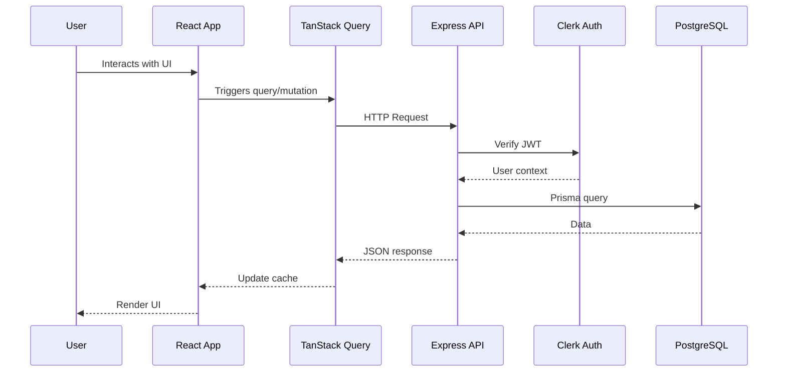

# Data Flow & Integrations

This document explains how data enters, moves through, and exits the Task Management System.

## High-level Flow

## Module Dependencies

### Server Dependencies
- **server/** → `prisma/client`, `@clerk/express`
- **server/storage.ts** → `@prisma/client` for database operations
- **server/auth.ts** → `@clerk/express` for authentication

### Client Dependencies
- **client/src/app/** → `features/*`, `shared/*`
- **client/src/features/tasks/** → `shared/hooks`, `shared/components`, `shared/lib`
- **client/src/features/clients/** → `shared/hooks`, `shared/components`, `features/tasks/lib`
- **client/src/features/meetings/** → `shared/hooks`, `shared/components`
- **client/src/features/auth/** → `shared/components`, `@clerk/clerk-react`

## Service Layer

### Backend Services
- [`DbStorage`](../server/storage.ts) - Primary data access class
  - User operations: `getUser`, `createUser`, `updateUser`
  - Task operations: `getTasks`, `createTask`, `updateTask`, `deleteTask`
  - Client operations: `getClients`, `createClient`, `updateClient`
  - Meeting operations: `getMeetings`, `createMeeting`

### Frontend Services
- [`apiRequest`](../client/src/shared/lib/queryClient.ts) - HTTP client wrapper
- [`useCurrentUser`](../client/src/features/users/hooks/useCurrentUser.ts) - User context hook

## Data Flow Patterns

### Query Flow (Read Operations)

1.  **Component Mount**: A React component renders.
2.  **Query Initialization**: A TanStack Query hook is triggered.
3.  **Cache Check**: The system checks if the requested data already exists in the query cache.
4.  **API Request**: If the data is stale or missing, an HTTP request is sent to the API.
5.  **Authentication**: Clerk middleware validates the JWT sent with the request.
6.  **Database Query**: Prisma executes the corresponding SQL query against the database.
7.  **Response**: Data flows back from the database through the API.
8.  **Cache Update**: TanStack Query updates its cache with the received data.
9.  **Re-render**: The component re-renders with the fresh data.

### Mutation Flow (Write Operations)

1.  **User Action**: The user submits a form or clicks a button that triggers a data modification.
2.  **Optimistic Update**: (Optional) The UI is updated immediately to reflect the anticipated change before the server confirms.
3.  **API Request**: A POST, PUT, PATCH, or DELETE request is sent to the API.
4.  **Validation**: The server validates the incoming data.
5.  **Database Write**: Prisma executes the necessary transaction to write data to the database.
6.  **Cache Invalidation**: Queries related to the modified data are invalidated.
7.  **Refetch**: Fresh data is fetched from the server to update the cache and UI.

## Internal Movement

### State Management
- **Server State**: Managed by TanStack Query, which handles caching and background refetching automatically.
- **Client State**: Managed using React's `useState` and `useReducer` hooks for local UI state.
- **URL State**: Managed by React Router for handling navigation and URL parameters.

### Cross-Feature Communication
- **Context Providers**: For example, `ClientsProvider` shares client-related state across multiple components.
- **Query Keys**: Consistent query keys are used to enable cross-feature cache invalidation.
- **Shared Types**: Common type definitions (e.g., from `client/src/shared/types/types.ts`) ensure data consistency across different parts of the application.

## External Integrations

### Clerk Authentication
- **Purpose**: Handles user authentication and session management.
- **Flow**: JWT tokens are sent in the `Authorization` header with API requests.
- **Middleware**: The `clerkAuthMiddleware` on the server validates these tokens.
- **User Data**: Authenticated user ID and metadata are made available via `req.auth` on the server.

### AI Summary (Meetings)
- **Purpose**: Generates summaries for meetings using an AI service.
- **Payload**: The request includes meeting notes, relevant context, and agenda items.
- **Response**: Returns a structured summary containing highlights, decisions, and action items.

## Observability & Failure Modes

### Logging
- **Server Logging**: Implemented using the `log()` function in `server/app.ts`.
- **API Logging**: Logs are generated for incoming/outgoing API requests and responses.
- **Error Tracking**: Specific logging is in place for tracking failed operations.

### Error Handling
- **API Errors**: Express error middleware is used to return structured error responses.
- **Query Errors**: TanStack Query manages retries and error states for data fetching.
- **Auth Errors**: Clerk handles session expiration and refresh errors, often redirecting the user to a login page.

### Retry Strategy
- **TanStack Query**: Configured to attempt retries 3 times with exponential backoff for failed queries.
- **Network Errors**: Automatic retries are attempted when the network connection is re-established.
- **Auth Errors**: API requests that result in authentication errors (401) trigger a redirect to the login page.

## Related Resources

- [Architecture Notes](./architecture.md)
- [Security & Compliance](./security.md)
