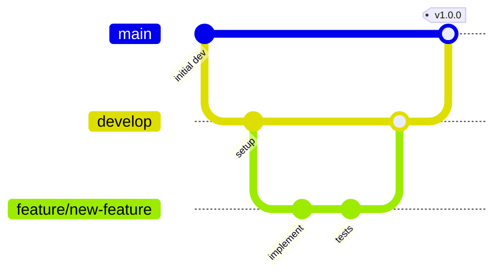

# Development Workflow

This document outlines the standard development workflow, branching strategy, commit conventions, and contribution guidelines for this project.

## Getting Started

### Prerequisites

*   Node.js 18+
*   PostgreSQL database
*   npm or pnpm package manager

### Setup

1.  **Install Dependencies**:
    ```bash
    npm install
    ```
    or
    ```bash
    pnpm install
    ```

2.  **Configure Environment Variables**:
    Copy the example environment file and fill in your specific credentials:
    ```bash
    cp .env.example .env
    ```
    Edit the `.env` file with your database connection string and Clerk API keys.

3.  **Run Database Migrations**:
    Apply the initial database schema:
    ```bash
    npx prisma migrate dev
    ```

4.  **Start Development Server**:
    ```bash
    npm run dev
    ```
    or
    ```bash
    pnpm dev
    ```

## Development Commands

| Command              | Description                                          |
| :------------------- | :--------------------------------------------------- |
| `npm run dev`        | Starts the development server with hot module reloading. |
| `npm run build`      | Builds the production-ready frontend bundle.         |
| `npm run test`       | Executes the test suite.                             |
| `npm run lint`       | Runs ESLint for code linting.                        |
| `npx prisma studio`  | Opens the Prisma database GUI for inspection.        |
| `npx prisma migrate dev` | Creates and applies new database migrations.       |

## Branching Strategy

### Branch Types

*   **`main`**: Contains production-ready, stable code.
*   **`develop`**: The integration branch for ongoing development. Features are merged here first.
*   **`feature/*`**: For developing new features. Example: `feature/turbo-mode`.
*   **`fix/*`**: For bug fixes. Example: `fix/task-status-update`.
*   **`refactor/*`**: For code refactoring without changing functionality. Example: `refactor/hooks-cleanup`.

### Workflow



1.  **Create a branch**: Based on the `develop` branch.
2.  **Implement changes**: Make your changes, stage, and commit often following Conventional Commits.
3.  **Open a Pull Request (PR)**: Target the `develop` branch.
4.  **Code Review**: Ensure the PR is descriptive, addresses the issue, and has passing tests.
5.  **Merge**: Once approved, merge the PR into `develop`.
6.  **Release**: Periodically, `develop` is merged into `main` for a release.

## Commit Conventions

We use [Conventional Commits](https://www.conventionalcommits.org/) for commit messages.

```
<type>(<scope>): <description>

[optional body]

[optional footer]
```

### Types

| Type     | Description                        |
| :------- | :--------------------------------- |
| `feat`   | Introduces a new feature.          |
| `fix`    | Patches a bug.                     |
| `docs`   | Changes to documentation only.     |
| `style`  | Code style changes (formatting).   |
| `refactor` | Restructures code without changing behavior. |
| `test`   | Adds or modifies tests.            |
| `chore`  | Maintenance tasks, build process.  |

### Examples

*   `feat(tasks): add turbo mode for bulk processing`
*   `fix(auth): handle expired session tokens`
*   `docs(readme): update installation instructions`
*   `refactor(hooks): extract common filter logic`

## Code Review Guidelines

### For Authors

*   Keep Pull Requests (PRs) focused and small.
*   Write clear and detailed PR descriptions.
*   Respond to feedback constructively.
*   Ensure all tests pass before requesting a review.

### For Reviewers

*   Aim to review PRs within 24 hours.
*   Provide constructive and specific feedback.
*   Approve once satisfied; avoid minor stylistic nitpicks if functionality is sound.
*   Test significant changes locally if necessary.

## Code Style

### TypeScript

*   Enable strict mode (`strict: true` in `tsconfig.json`).
*   Prefer `interface` over `type` for defining object shapes.
*   Use explicit return types for all functions.
*   Avoid using `any`; use `unknown` when the type is not known but intended to be checked.

### React

*   Use functional components with hooks.
*   Extract complex logic into custom hooks.
*   Use descriptive and consistent component naming.
*   Keep components focused on a single responsibility and composable.

### File Organization

Follow this structure within feature directories:

```
feature/
├── components/       # Reusable React UI components specific to the feature.
├── hooks/           # Custom React hooks for feature logic.
├── lib/             # Utility functions specific to the feature.
├── types/           # TypeScript types and interfaces for the feature.
├── pages/           # Top-level page components for routing.
└── index.ts         # Barrel file for exporting the feature's public API.
```

## Testing Guidelines

Please refer to the [Testing Strategy](./testing-strategy.md) document for detailed guidelines on writing and running tests.

## Environment Variables

These variables are essential for the application to run correctly.

| Variable             | Description                                   | Required |
| :------------------- | :-------------------------------------------- | :------- |
| `DATABASE_URL`       | PostgreSQL connection string.                 | Yes      |
| `CLERK_PUBLISHABLE_KEY` | Clerk publishable API key.                    | Yes      |
| `CLERK_SECRET_KEY`   | Clerk secret API key.                         | Yes      |
| `NODE_ENV`           | Application environment (`development`, `production`). | No       |

## Related Resources

*   [Architecture Notes](./architecture.md)
*   [Testing Strategy](./testing-strategy.md)
*   [Tooling Guide](./tooling.md)
