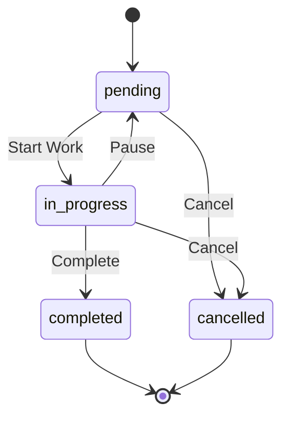

# Glossary & Domain Concepts

This document defines business terminology, domain concepts, and user personas for the Task Management System.

## Core Entities

### Task
A unit of work that needs to be completed. Tasks have attributes such as status, priority, assignee, associated client, and a due date.

### Client
An external entity (company or individual) that the team works with. Clients are characterized by contact information, address, status, and associated meetings and tasks.

### Meeting
A scheduled interaction with a client. Meetings can be of different types (call, video, in_person), have various statuses (scheduled, completed, cancelled), and include AI-generated or manual summaries, key decisions, and action items that can be converted into tasks.

### User
A system user with defined authentication and roles. Users have roles (admin, manager, user), can belong to groups for access control, and have a profile with basic information.

## Domain Concepts

### Task Status Flow

The typical lifecycle of a task involves transitions from `pending` to `in_progress`, and finally to `completed` or `cancelled`. Tasks can be paused and returned to a `pending` state from `in_progress`.

### Priority Levels

| Priority | Description        | SLA Guidance |
|----------|--------------------|--------------|
| Urgent   | Critical, immediate attention | Same day     |
| High     | Important, prioritize | 1-2 days     |
| Medium   | Standard priority  | Within a week|
| Low      | Can be deferred    | When available|

### Turbo Mode
A productivity feature designed for rapid task processing. It enables sequential task review, enhanced keyboard navigation, quick status updates, and a streamlined bulk processing workflow.

### WhatsApp Groups
An integration feature that links tasks to specific WhatsApp communication groups. This allows for tracking conversations related to tasks and associating external communication directly with internal task tracking, including status tracking for group memberships.

## User Roles

### Admin
Possesses full system access, including user management, system configuration, and complete data visibility across all entities.

### Manager
Responsible for team oversight, task assignment, client management, and has access to reporting functionalities.

### User
Focuses on managing their own tasks, interacting with clients, participating in meetings, and is generally limited to data relevant to their assigned responsibilities.

## Business Rules

### Task Assignment
1.  Tasks can be assigned to any active user.
2.  Unassigned tasks are visible to all users.
3.  Only the assignee or an administrator can complete a task.
4.  The task history logs all changes made to a task.

### Client Access
1.  Client visibility is determined by group membership.
2.  Administrators have visibility to all clients.
3.  Managers can view clients within their assigned groups.
4.  Users can see tasks related to clients they are assigned to.

### Meeting Scheduling
1.  Meetings must be associated with a client.
2.  Past meetings cannot be edited, with the exception of notes.
3.  AI summaries for meetings can be generated on demand.
4.  Action items identified in meetings can be converted into tasks.

## Technical Terms

| Term          | Definition                                           |
|---------------|------------------------------------------------------|
| **Prisma**    | TypeScript ORM for database access.                  |
| **TanStack Query** | A powerful library for managing server state.        |
| **Clerk**     | An authentication service provider.                  |
| **shadcn/ui** | A component library built on top of Radix UI.        |
| **Vite**      | A frontend build tool and development server.        |
| **Express**   | A minimal and flexible Node.js web application framework.|

## Abbreviations

| Abbreviation | Full Form                   |
|--------------|-----------------------------|
| API          | Application Programming Interface |
| CRUD         | Create, Read, Update, Delete|
| JWT          | JSON Web Token              |
| ORM          | Object-Relational Mapping |
| SPA          | Single Page Application     |
| UI/UX        | User Interface / User Experience|

## Related Resources

- [Project Overview](./project-overview.md)
- [Architecture Notes](./architecture.md)
- [Data Flow](./data-flow.md)
