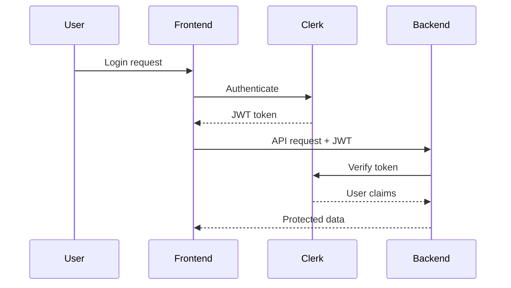

# Security & Compliance Notes

This document covers the security model, authentication, authorization, and compliance considerations for the application.

## Authentication

### Clerk Integration

The system utilizes [Clerk](https://clerk.com) for robust user authentication. Key features include:

*   **Session Management**: Implemented using JWT-based sessions with automatic refresh mechanisms to ensure continuous user access without frequent re-logins.
*   **Social Login**: Supports authentication via popular OAuth providers such as Google and GitHub, simplifying the login process for users.
*   **Multi-factor Authentication**: An optional two-factor authentication (2FA) layer is available to significantly enhance account security.
*   **Password Policies**: Configurable password requirements are enforced to ensure users create strong, secure passwords.

### Authentication Flow

The authentication process between the user, frontend, Clerk, and backend is visualized below:



### Token Handling

*   **Storage**: Authentication tokens are securely stored in HTTP-only cookies, mitigating risks associated with Cross-Site Scripting (XSS) attacks.
*   **Refresh**: Tokens are automatically refreshed before their expiration to provide a seamless user experience.
*   **Transmission**: All token transmissions are secured using HTTPS to prevent eavesdropping.
*   **Revocation**: Token revocation is handled upon user logout to ensure immediate termination of sessions.

## Authorization

### Role-Based Access Control (RBAC)

Access to system resources is managed through Role-Based Access Control (RBAC), ensuring users only have permissions necessary for their roles.

| Role    | Capabilities                                                        |
| :------ | :------------------------------------------------------------------ |
| Admin   | Full system access, user management, configuration                  |
| Manager | Team management, client oversight, reporting                        |
| User    | Own tasks, assigned clients, meeting participation                  |

### Permission Matrix

The following matrix details resource access based on user roles:

| Resource        | Admin | Manager     | User        |
| :-------------- | :---- | :---------- | :---------- |
| View all tasks  | Yes   | Yes (group) | No          |
| Create tasks    | Yes   | Yes         | Yes         |
| Assign tasks    | Yes   | Yes         | No          |
| Delete tasks    | Yes   | No          | No          |
| View all clients| Yes   | Yes (group) | No          |
| Create clients  | Yes   | Yes         | No          |
| Manage users    | Yes   | No          | No          |

### Middleware Implementation

Authorization logic is enforced server-side using middleware. For example, the `requireRole` function checks if the authenticated user's role matches the required roles for an endpoint.

```typescript
// server/auth.ts
export function requireRole(roles: string[]) {
  return (req, res, next) => {
    const userRole = req.auth?.sessionClaims?.role;
    if (!roles.includes(userRole)) {
      return res.status(403).json({ error: 'Forbidden' });
    }
    next();
  };
}

export const requireAdmin = requireRole(['admin']);
```

## Data Protection

### Database Security

*   **Connection Encryption**: All database connections are encrypted using TLS to protect data in transit.
*   **Credentials Management**: Sensitive database credentials are managed securely via environment variables, never hardcoded.
*   **SQL Injection Prevention**: The ORM (Prisma) used by the application automatically handles query parameterization, effectively preventing SQL injection vulnerabilities.
*   **Access Control**: Database users are configured with the principle of least privilege, granting only the necessary permissions for application operation.

### API Security

*   **CORS Configuration**: Cross-Origin Resource Sharing (CORS) is strictly configured to allow requests only from explicitly defined, trusted origins.
*   **Rate Limiting**: Implementing rate limiting on API endpoints is recommended to protect against brute-force attacks and general abuse.
*   **Input Validation**: All incoming data from the client is rigorously validated on the server-side to ensure data integrity and prevent malicious inputs.
*   **Error Handling**: API responses provide generic error messages to avoid leaking sensitive information about the server's internal state or potential vulnerabilities.

### Sensitive Data Handling

| Data Type      | Protection Mechanism                                 |
| :------------- | :--------------------------------------------------- |
| Passwords      | Managed by Clerk (hashed and salted)                 |
| API Keys       | Stored exclusively in environment variables          |
| User PII       | Access is strictly controlled by user role           |
| Session Tokens | Stored in HTTP-only cookies, transmitted over HTTPS |

## Security Headers

To enhance the security posture of the application, the following security-related HTTP headers are recommended for production environments:

```typescript
// Security headers middleware
app.use((req, res, next) => {
  res.setHeader('X-Content-Type-Options', 'nosniff'); // Prevents MIME-sniffing
  res.setHeader('X-Frame-Options', 'DENY'); // Prevents clickjacking by disallowing framing
  res.setHeader('X-XSS-Protection', '1; mode=block'); // Enables built-in XSS protection
  res.setHeader('Strict-Transport-Security', 'max-age=31536000'); // Enforces HTTPS
  next();
});
```

## Audit & Logging

### Activity Logging

Comprehensive logging is crucial for security monitoring and incident investigation. The system logs events such as:

*   User authentication events (successful logins, logouts, failed attempts).
*   Data modification events (creation, updates, deletions of key resources).
*   Administrative actions (user management, system configuration changes).

### Task History

The `TaskHistory` entity provides an immutable log of all changes made to tasks. Each entry details:

*   The user responsible for the modification.
*   The timestamp of the change.
*   A record of the specific fields that were altered, including their previous and new values.

## Compliance Considerations

### Data Retention

*   **User Data**: User data is retained as long as their account is active. Upon account deletion, personal data is purged, though anonymized audit logs may be retained for a defined period.
*   **Meeting Notes**: Meeting notes are retained in accordance with business record-keeping policies.

### Privacy

*   **Minimal Data Collection**: Adheres to the principle of collecting only the data strictly necessary for application functionality.
*   **User Consent**: User consent is obtained for data processing activities where applicable.
*   **Data Export**: Functionality for users to export their data is provided, supporting GDPR compliance.
*   **Right to Deletion**: The system is designed to support user requests for data deletion, aligning with privacy regulations.

---

## Audit Findings (2026-02-08)

A comprehensive security audit identified **15 vulnerabilities**. See `.context/plans/software-audit.md` for the full report with code evidence.

### Vulnerability Summary

| # | Vulnerability | Severity | OWASP Category | Status |
|---|---|---|---|---|
| S1 | **IDOR: Meeting Details** - `/api/meetings/:id/detail` has no access control | **Critical** | A01: Broken Access Control | Open |
| S2 | **IDOR: Transcripts** - `/api/transcripts/:id` has no authorization | **Critical** | A01: Broken Access Control | Open |
| S3 | **IDOR: Client Scheduling** - `PATCH /api/clients/:id/scheduling-sent` no ownership check | **High** | A01: Broken Access Control | Open |
| S4 | **Missing Input Validation** - Zod installed but not used in any route | **High** | A03: Injection | Open |
| S5 | **`requireGroupAccess` never used** - Middleware defined but applied to 0 endpoints | **High** | A01: Broken Access Control | Open |
| S6 | **Insufficient RBAC** - Only 1 of 11 endpoints uses role check | **High** | A01: Broken Access Control | Open |
| S7 | **Missing env validation** - `CLERK_SECRET_KEY`, `DATABASE_URL` unchecked at startup | **High** | A05: Security Misconfiguration | Open |
| S8 | Hardcoded production URL fallback | Medium | A05: Security Misconfiguration | Open |
| S9 | Error handler `throw err` after `res.json()` | Medium | A05: Security Misconfiguration | Open |
| S10 | Clerk error messages leaked to client | Medium | A04: Insecure Design | Open |
| S11 | No CORS config, no Helmet, no security headers | Medium | A05: Security Misconfiguration | Open |
| S12 | No rate limiting on any endpoint | Medium | A04: Insecure Design | Open |
| S13 | Fireflies API key forwarded without format validation | Medium | A07: Auth Failures | Open |
| S14 | Weak ID validation (`parseInt` only) | Low | A03: Injection | Open |
| S15 | No request size limits on `express.json()` | Low | A05: Security Misconfiguration | Open |

### Endpoint Authorization Matrix (Actual)

| Method | Endpoint | Auth | RBAC | Group Check | **Gap** |
|--------|----------|------|------|-------------|---------|
| GET | `/api/auth/me` | clerkAuth | - | - | - |
| POST | `/api/auth/sync` | clerkAuth | - | - | - |
| GET | `/api/users/team` | clerkAuth | - | groupId filter | - |
| POST | `/api/invitations` | clerkAuth | **requireAdmin** | - | - |
| PUT | `/api/users/fireflies-key` | clerkAuth | manual consultor | - | Weak |
| POST | `/api/users/fireflies-key/test` | clerkAuth | - | - | **No role** |
| GET | `/api/meetings/:id/detail` | clerkAuth | - | **NONE** | **IDOR** |
| GET | `/api/transcripts/:id` | clerkAuth | - | **NONE** | **IDOR** |
| PATCH | `/api/users/calendar-link` | clerkAuth | - | - | **No role** |
| PATCH | `/api/clients/:id/scheduling-sent` | clerkAuth | - | **NONE** | **IDOR** |
| POST | `/api/validate-foundation` | clerkAuth | - | - | **No role** |

### Positive Security Findings

- Clerk JWT authentication properly implemented
- Prisma ORM prevents SQL injection via parameterized queries
- RBAC infrastructure exists (`requireRole`, `requireAdmin`, `requireGroupAccess`)
- HTTPS enforced in production (Railway.app)
- No hardcoded database credentials
- TypeScript provides compile-time type safety

### Remediation Priority

1. **Immediate (< 1 day)**: Fix IDOR on S1, S2, S3. Remove DEV_BYPASS_AUTH. Add env validation.
2. **Week 1**: Apply `requireGroupAccess` to all data endpoints. Add Zod validation. Install helmet + CORS + rate-limit.
3. **Week 2**: Implement structured logging. Add role checks to remaining endpoints. Harden Fireflies key handling.

---

## Security Checklist

### Development Phase

*   [ ] Never commit secrets (API keys, passwords, etc.) to version control.
*   [ ] Utilize environment variables for all sensitive configuration and credentials.
*   [ ] Implement robust validation and sanitization for all user-provided input.
*   [ ] Ensure all database queries are parameterized (Prisma assists with this).

### Deployment Phase

*   [ ] Always enable HTTPS for secure communication.
*   [ ] Configure and deploy recommended security headers.
*   [ ] Implement rate limiting on public-facing APIs.
*   [ ] Set up comprehensive logging and monitoring systems.
*   [ ] Regularly update all project dependencies to patch known vulnerabilities.

### Operations Phase

*   [ ] Conduct regular security audits and vulnerability assessments.
*   [ ] Establish and maintain an incident response plan.
*   [ ] Implement and test regular backup and recovery procedures.
*   [ ] Periodically review user access permissions.

## Related Resources

*   [Architecture Notes](./architecture.md)
*   [Development Workflow](./development-workflow.md)
